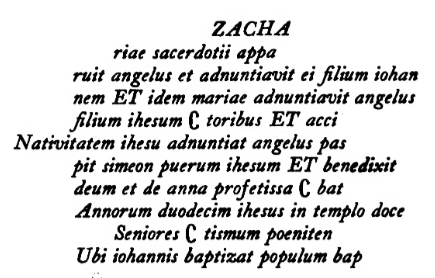

# React + Vite

This project is a POC to show [a few new devices for pointing] at what sense the author is intending to mean/indicate:
- [`[` ... `]`]
  - This device encapsulates a selection of text and makes it a SINGLE "sense-unit"
- [`(` ... `)`]
  - This device encapsules a selection of text and defaults it to a collapsed parenthetical that expands into view upon the [target-text] getting focused on

Excerpt from [The Book of Kells].pdf preface:


```
ZACHA
riae sacerdotii appa
ruit angelus et adnuntiavit eifilium iohan
nem ET idem mariae adnuntiavit angelus
filium ihesum C toribus ET acci
Nativitatem ihesu adnuntiat angelus pas
pit simeon puerum ihesum ET benedixit
deum et de anna projetissa C bat
Annorum duodecim ihesus in templo doce
Seniores C tismum poeniten
Ubi iohannis baptizat populum bap

The turnr^ The symbol C> known in Irish MSS. as " head under the wing "
under the] or " turn under the path'*—which, as will be seen, occurs three times
path. ! on this page—indicates that the words immediately following it are to
/ be read after the end of the next full line. The first of the above passages
\ in which it occurs will therefore read:
—
adnuntiavit angelus filium ihesum Nativitatem ihesu adnuntiat
angelus pastoribus ET accipit simeon, etc
The " turn under the path " occasionally takes other shapes. A
curious instance of its altered form is to be found in the "Pater Noster,"
fol. 297 V., where it appears at the beginning of the half line in the
figure of a small man apparently in the act of jumping, with one of his
legs cocked up and the other turned down towards the following line of
the text
```

## Expanding the ESLint configuration

If you are developing a production application, we recommend using TypeScript with type-aware lint rules enabled. Check
out the [TS template](https://github.com/vitejs/vite/tree/main/packages/create-vite/template-react-ts) for information
on how to integrate TypeScript and [`typescript-eslint`](https://typescript-eslint.io) in your project.
